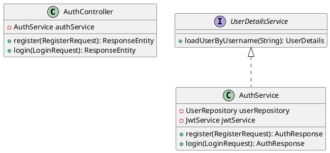
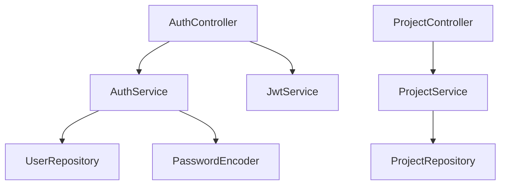
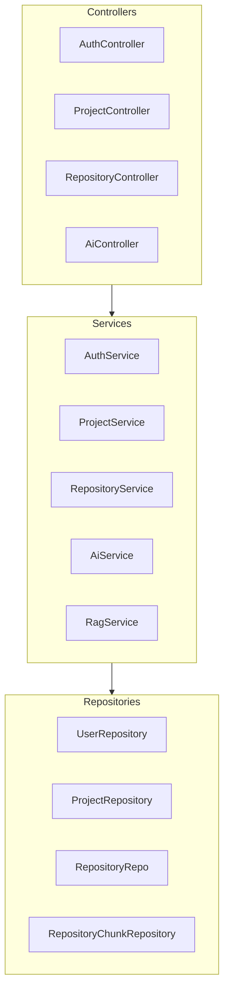

# UML & Diagram Architecture — CodeSense AI

> **Owner**: Prashanthi (Team Member 4) — Code Intelligence Module

---

## Overview

CodeSense AI generates three types of diagrams from parsed repository data:

1. **Class Diagrams** — UML class hierarchy using PlantUML
2. **Dependency Graphs** — Mermaid flowcharts showing module/package dependencies
3. **Architecture Diagrams** — Mermaid diagrams showing system layers (controllers, services, repositories)

All diagrams are based **only on parser metadata** — no relationships are invented.

---

## Class Diagrams (PlantUML)

### Tool: PlantUML 1.2023.12

### What is extracted:
- Classes, interfaces, enums, abstract classes
- Inheritance (`extends`)
- Interface implementation (`implements`)
- Field types
- Method signatures

### Example Output:



### API:

```
POST /api/parser/uml/class?repositoryId={id}

Response:
{
  "plantuml": "@startuml\n...\n@enduml",
  "mermaid":  "classDiagram\n...",
  "elementCount": 12
}
```

---

## Dependency Graphs (Mermaid)

### Tool: JGraphT 1.5.2 + Mermaid syntax

### What is extracted:
- Package → package dependencies (from imports)
- Module → module relationships
- Class → class calls (from method call analysis)

### Relationship types:

```java
public enum RelationshipType {
    IMPORTS,      // file A imports file B
    CALLS,        // method A calls method B
    EXTENDS,      // class A extends class B
    IMPLEMENTS,   // class A implements interface B
    USES,         // class A uses class B (field/parameter)
    REFERENCES,   // weaker reference
    DEPENDS_ON    // package-level dependency
}
```

### Example Mermaid Output:



### API:

```
GET /api/parser/dependencies?repositoryId={id}

Response:
{
  "mermaidGraph":    "graph TD\n...",
  "nodeCount":       15,
  "edgeCount":       23,
  "topDependencies": ["AuthService", "ProjectService"]
}
```

---

## Architecture Diagrams (Mermaid)

### What is analyzed:
- Package names → layer detection (controller, service, repository, model, config)
- Class name suffixes → type detection (`*Controller`, `*Service`, `*Repository`)
- Import patterns → external service detection

### Example Output:



### API:

```
GET /api/parser/architecture?repositoryId={id}

Response:
{
  "mermaid":       "graph TB\n...",
  "plantuml":      "@startuml component\n...\n@enduml",
  "layers":        {"controllers": 4, "services": 8, "repositories": 5},
  "languages":     ["Java", "TypeScript"]
}
```

---

## Frontend Rendering

The React frontend receives Mermaid strings and renders them using `mermaid.js`:

```jsx
// ArchitecturePage.jsx / DependenciesPage.jsx
import mermaid from 'mermaid';

useEffect(() => {
  mermaid.initialize({ startOnLoad: false, theme: 'dark' });
  mermaid.render('graph-id', mermaidString).then(({ svg }) => {
    container.innerHTML = svg;
  });
}, [mermaidString]);
```

PlantUML is rendered server-side and can be returned as SVG or PNG via PlantUML's rendering API.

---

## Accuracy Notes

The diagrams only include relationships that can be **statically inferred** from source code:
- Class declarations found in parsed files
- Import statements
- Method call expressions (best-effort for dynamic dispatch)
- Inheritance/implementation declarations

The system does NOT:
- Invent relationships not present in source
- Infer runtime behavior
- Analyze reflection-based dependencies
- Cross-process relationships (e.g., HTTP calls between services)

For cross-language relationships (e.g., TypeScript frontend → Java REST API), the system only marks them when URL patterns or API definitions are explicitly present in both codebases.
